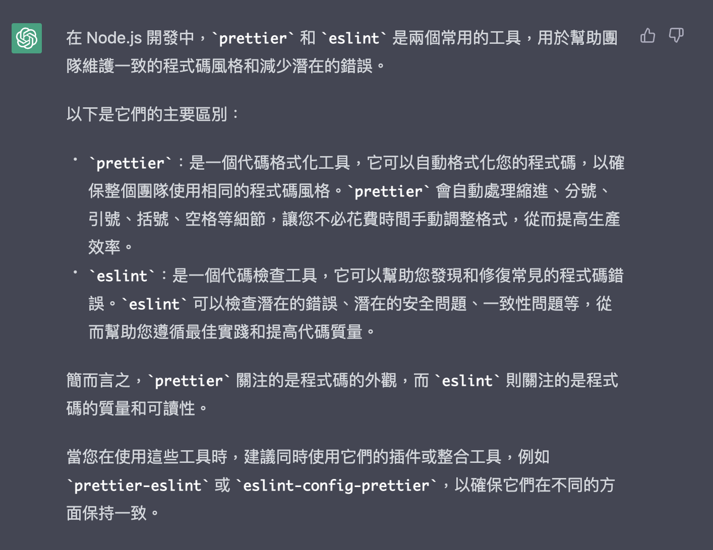

# noteflow-backend

## 常用port(localhost)
|  port   | services  |
|  ----  | ----  |
| 3000  | node.js |
| 27017  | mongo |
| 8081  | mongo express |
| 5432  | postgresql |
| 6379  | redis |

## configuration
1. config 檔案皆在 /config/*
2. Database
```bash=
# migrate
npm run db:migrate
```

```bash=
# rollback
npm run db:rollback
```

3. docker
```bash=
docker compose --env-file ./config/.env.development up -d
```

4. node.js
```bash=
npm run start
```

### development tools
> vscode, docker, pgadmin, postman

### 這個資料夾的樹狀結構
```
├── node_modules        npm install 載好的 library 在這裡面
    ├── .bin            放下載的 library 提供的可執行檔
    ├── (libraries..)
├── .env                跑程式時會自動 import 的環境變數
├── .eslintrc.json      協助改善你的 Coding & Coding Style
├── .prettierrc         Prettify 你的 Code
├── README.md
├── docker-compose.yml  會直接透過 docker 部署的程式
├                       e.g. MongoDB & PostgreSQL
├── package.json        我們這個 project 的 overview &
├                       我們自行定義的運行腳本 &
├                       所有下載的 library 都會在這邊展示
├── package-lock.json   下載好的 library 具體版本 & dependency
└── src
    ├── app.js          entry point
    └── router.js       router
```

# 將後端以及資料庫起起來

```bash
npm install
```

使用以下指令，把 MongoDB 給起起來
```bash
docker compose --env-file ./config/.env.development up -d
## 可以使用 docker compose down 關閉
```

接下來使用以下指令把後端給起起來
```bash
npm run start
## npm run [command]，這個 command 在 package.json 裡面便有規範
## start 對應到 "nodemon ./src/app.js"
```

app.js 裡面寫的東西：

```js
import Koa from 'koa'; // 快速開啟伺服器並監聽
import {koaBody} from 'koa-body';
import router from './router.js';

import * as dotenv from 'dotenv'; 

dotenv.config(); // 讀 .env 檔並把裡面的變數登錄到 local 的環境變數裡面
const { MONGO_INITDB_ROOT_USERNAME, MONGO_INITDB_ROOT_PASSWORD } = process.env; // 把登錄進去的變數給取出來

const app = new Koa();

app.keys = ['session secret...'];
const SESSION_CONFIG = {
  key: 'koa.sess',
  maxAge: 86400000, // 一天後需要重新登入
  autoCommit: true,
  overwrite: true,
  httpOnly: true,
  signed: true,
  rolling: true,
  renew: true
};
app.use(session(SESSION_CONFIG, app)); // 處理登入的 session

app.use(koaBody()); // 幫助 parse xml or json or 表格資料
app.use(router.routes()); // 登錄路由

app.listen(3000); // 開始接受服務

export { app };

```

# Prettier & Eslint


1. .prettierrc 是 prettier 的參數調整檔案
2. .eslintrc.json 是 eslint 的參數調整檔案

prettier 和 eslint 如果下載並安裝好，便會預設在 VSCode 的背景中執行。

如果 Prettier 沒有發揮作用：

1. Shift+Command+P
2. Preference: Open User Setting (JSON)
3. 貼上以下代碼：
```json
{
 "[javascript]": {
        "editor.formatOnSave": true,
        "editor.defaultFormatter": "esbenp.prettier-vscode",
    },
}
```
4. 這樣應該就可以 Format on save 了。

如果 Eslint 沒有發揮作用，那可能就是沒有在 VS Extension 下載 Eslint 插件。


# Some useful links
Koa example
https://github.com/koajs/examples
koajs/examples: Example Koa apps (github.com)

Mongo
https://www.mongodb.com/
MongoDB: The Developer Data Platform | MongoDB

GraphQL
https://graphql.org/
GraphQL | A query language for your API

Docker
https://hub.docker.com/_/mongo/
mongo - Official Image | Docker Hub